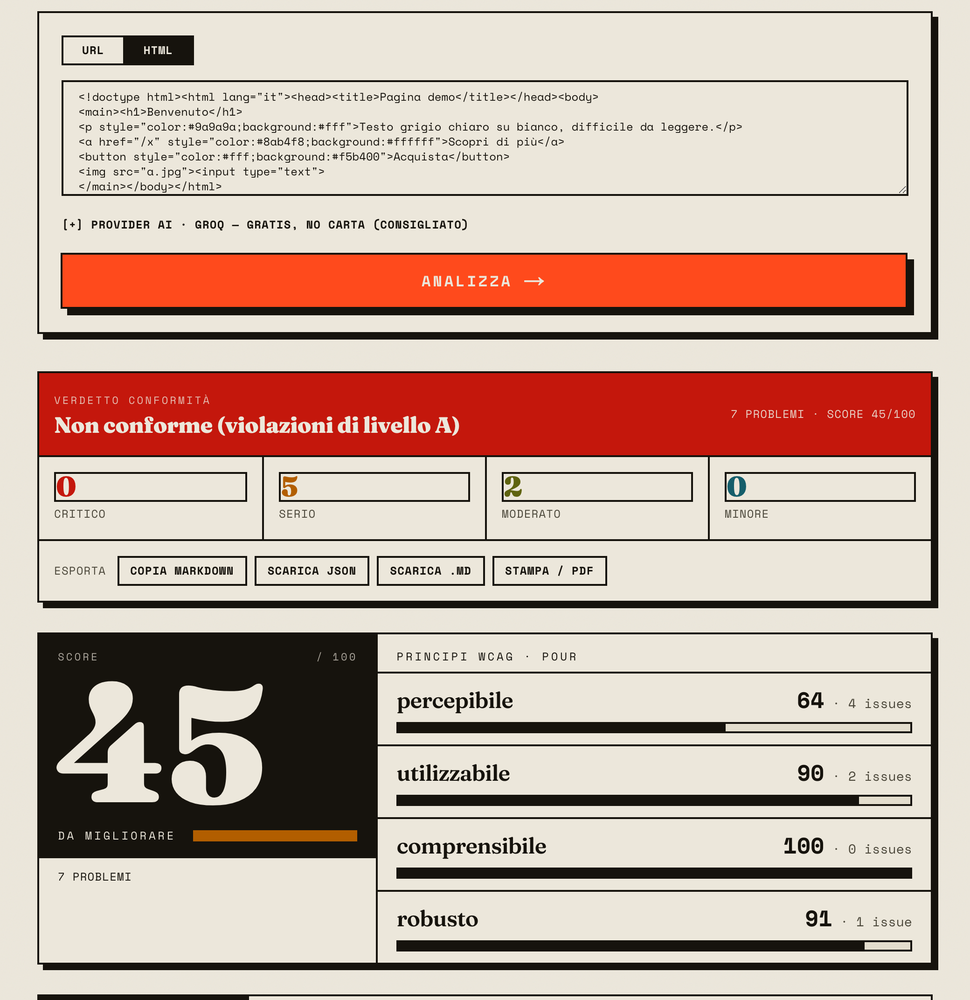
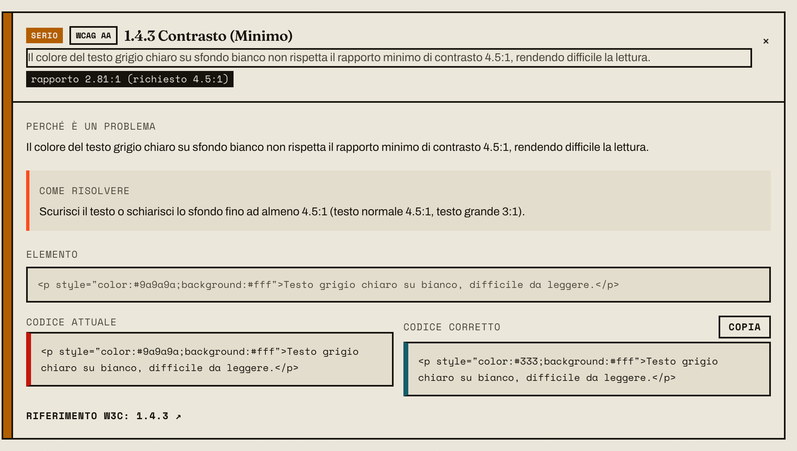

<h1 align="center">Accessibility Auditor</h1>

<p align="center"><em>Paste a URL or raw HTML, get a WCAG 2.2 audit with measured numbers, ready-to-paste fixes and an exportable report.</em></p>

<p align="center">
  
  
  
  
  
  
</p>

<p align="center">
  <a href="https://accessibility-auditor-simiriva95s-projects.vercel.app"><strong>Live demo</strong></a> ·
  <a href="https://github.com/simiriva95/accessibility-auditor/issues">Report a bug</a>
</p>

<p align="center"></p>

Most "AI accessibility checkers" ask a language model what the contrast ratio is. A model does not
see pixels, so it guesses — and the number changes between runs. This tool splits the job: every
measurable signal (contrast ratios, ARIA wiring, heading structure, target sizes, duplicate ids) is
computed in deterministic TypeScript from the page's static HTML and CSS, while the AI layer is
optional and confined to prose and code fixes. If the AI call fails, the audit still stands.

## Features

- **26 deterministic WCAG 2.2 checks** over a Cheerio DOM, each carrying criterion, level (A/AA/AAA), severity, why it matters, who it affects, and a remediation — all available with no API key.
- **Real contrast math, not an estimate** — relative luminance and the WCAG ratio formula, with AA/AAA thresholds and the large-text rule applied per element.
- **External CSS is fetched and inlined** before analysis, so colours declared in linked stylesheets are seen too — no headless browser required.
- **0–100 score with a POUR breakdown** (Perceivable, Operable, Understandable, Robust) plus a conformance verdict derived from the highest failing level.
- **Optional AI enrichment, bring your own key** — Groq, Anthropic, OpenAI, or any OpenAI-compatible local endpoint (Ollama, LM Studio). The key stays in browser memory, never in `localStorage`.
- **On-page SEO / indexability panel** — title, meta description, robots, canonical, Open Graph, JSON-LD, HTTPS and more, scored separately.
- **SSRF-guarded fetching** — every redirect hop is re-validated; private, loopback, link-local, CGNAT and cloud-metadata addresses are refused.
- **Exportable report** — copy as Markdown, download Markdown or JSON, or print to PDF via a print stylesheet.
- **The tool is itself accessible** — skip link, semantic landmarks, visible focus styles, `aria-expanded` / `aria-pressed` state on controls.

<p align="center"></p>

## Tech stack

| Layer | Choice |
|---|---|
| Framework | Next.js 14.2.35 (App Router, Node.js runtime) |
| Language | TypeScript 5, React 18 |
| Styling | Tailwind CSS 3.4, Google Fonts (Fraunces, Archivo, Space Mono) via `next/font` |
| HTML parsing | Cheerio 1.2 |
| AI (optional) | Vercel AI SDK 7 with `@ai-sdk/openai` and `@ai-sdk/anthropic` |
| Schema validation | Zod 4 (`generateObject` structured output) |
| Tests | Inline self-checks, no test framework |

## Getting started

Prerequisites: Node.js 18.17+ (Next.js 14 requirement) and npm.

```bash
git clone https://github.com/simiriva95/accessibility-auditor
cd accessibility-auditor
npm install
npm run dev        # http://localhost:3000
```

Other scripts:

```bash
npm run build      # production build
npm run start      # serve the production build
npm run lint       # next lint
```

The deterministic modules carry inline self-checks instead of a test framework — each file runs its
own assertions when executed directly:

```bash
npx tsx lib/contrast.ts       # e.g. asserts black on white == 21:1
npx tsx lib/wcag-checks.ts
npx tsx lib/css-contrast.ts
npx tsx lib/fetch-css.ts
npx tsx lib/seo-checks.ts
npx tsx lib/ssrf.ts
```

## Configuration

No configuration is required: with no key at all the app runs the full deterministic audit, and users
can supply their own AI key from the UI. The server-side variables below exist only so a public demo
can offer AI enrichment without asking the visitor for a key.

| Variable | Required | What it does |
|---|:--:|---|
| `GROQ_API_KEY` | No | Server-side fallback key. When set, requests without a client-supplied key are enriched via Groq. Never exposed to the browser. |
| `GROQ_MODEL` | No | Overrides the default Groq model (`openai/gpt-oss-20b`). |

Client-supplied AI settings (provider, API key, model, base URL) travel in the audit request body
only; nothing is persisted server-side.

| Provider | Default model |
|---|---|
| Groq | `openai/gpt-oss-20b` |
| Anthropic | `claude-sonnet-4-6` |
| OpenAI | `gpt-4o-mini` |
| OpenAI-compatible (local) | `llama3.1` at `http://localhost:11434/v1` |

## How contrast is computed

This is the part deliberately not delegated to a model.

1. `lib/css-contrast.ts` parses every `<style>` block and inline `style` attribute into rules, then
   resolves an element's effective `color`, `background-color`, `font-size` and boldness by matching
   **simple selectors only** — tag, `.class`, `#id` and compounds of those, source order wins.
2. `lib/contrast.ts` parses the resulting CSS colours (`#rgb`, `#rrggbb`, `#rrggbbaa`, `rgb()`,
   `rgba()`, a small set of named colours) into RGB. Fully transparent values return `null`.
3. Relative luminance is computed per channel with the sRGB transfer function
   (`c/255`, then `/12.92` at or below 0.03928, else `((c+0.055)/1.055)^2.4`), weighted
   `0.2126 / 0.7152 / 0.0722`.
4. The ratio is `(Llighter + 0.05) / (Ldarker + 0.05)`, rounded to two decimals.
5. Thresholds follow WCAG: large text is `>= 24px`, or `>= 18.66px` when bold; AA needs 4.5:1
   (3:1 large), AAA needs 7:1 (4.5:1 large). Failures emit **1.4.3** (AA, serious) or **1.4.6**
   (AAA, minor), with the measured ratio attached to the finding.

**If a colour or background cannot be resolved, no issue is emitted.** Unknown is never guessed.
Findings are deduplicated per colour/size combination and capped at 50 per page. The formula is
verifiable against known pairs — the self-check asserts black on white is exactly 21:1.

## WCAG 2.2 criteria actually checked

| Criterion | Level | What is detected |
|---|:--:|---|
| 1.1.1 Non-text Content | A | `` without `alt`; `input[type=image]` without `alt` |
| 1.2.2 Captions (Prerecorded) | A | `<video>` with no caption/subtitle track |
| 1.3.1 Info and Relationships | A | form controls without a label; `label[for]` pointing nowhere; broken `aria-labelledby`/`aria-describedby`; heading-level skips and empty headings; missing or duplicated `<main>`; `<li>` outside a list; radio/checkbox groups without `fieldset`+`legend`; data tables without headers |
| 1.3.5 Identify Input Purpose | AA | personal-data fields (email, tel, …) without `autocomplete` |
| 1.4.3 Contrast (Minimum) | AA | measured text/background ratio below 4.5:1 (3:1 large) |
| 1.4.4 Resize Text | AA | viewport meta blocking zoom (`user-scalable=no`, `maximum-scale` < 2) |
| 1.4.6 Contrast (Enhanced) | AAA | ratio passing AA but below 7:1 (4.5:1 large) |
| 2.4.1 Bypass Blocks | A | navigation present but no in-page skip link |
| 2.4.2 Page Titled | A | missing `<title>` (full documents only) |
| 2.4.3 Focus Order | A | positive `tabindex` |
| 2.4.4 Link Purpose (In Context) | A | generic link text ("click here"), empty `href`, icon-only links with no accessible name |
| 2.5.8 Target Size (Minimum) | AA | interactive elements whose inline `width`/`height` is declared below 24px |
| 3.1.1 Language of Page | A | missing `lang`, or a value that is not valid BCP 47 |
| 3.2.5 Change on Request | AAA | `target="_blank"` links with no warning |
| 4.1.2 Name, Role, Value | A | controls without an accessible name; invalid ARIA roles; duplicate `id`s; `<iframe>` without `title` |

One extra advisory finding flags pages whose shell is rendered by JavaScript, where static analysis is
not representative. Repeated identical findings are grouped: one repeated component means one issue to
fix. Each finding links to the matching W3C *Understanding WCAG 2.2* page.

## How it works

```
URL ──▶ SSRF-guarded fetch (10s timeout, 2 MB cap, every redirect re-validated)
     └▶ external <link rel=stylesheet> downloaded and inlined (max 12 files, 1.5 MB budget)
        └▶ wcag-checks.ts  → Issue[]  (deterministic, always runs)
           └▶ scoring.ts   → 0-100 overall + per-POUR breakdown
              └▶ ai.ts     → optional enrichment (explanations + before/after code)
                 └▶ report.ts → verdict, Markdown export
```

The AI layer receives the deterministic findings (id, criterion, level, severity, element, measure)
plus up to 18,000 characters of HTML, and is instructed never to recompute numbers. It returns a
Zod-validated object keyed by issue id, and may add only *qualitative* issues a parser cannot see — an
`alt` that exists but does not describe, ambiguous link text in context, reading order. Any AI failure
is surfaced as a non-blocking warning and the deterministic result is returned intact.

Scoring is a pure function of the issue list: 15/9/5/2 points subtracted per critical/serious/moderate/
minor finding, clamped to 0–100, computed both overall and per principle. The verdict reports the
highest level with no violations found, and is scoped to what static analysis can see — it is not a
legal conformance statement.

## Project structure

```
app/
  page.tsx              UI: URL/HTML input, AI provider picker, results
  layout.tsx            fonts + metadata
  api/audit/route.ts    orchestration: fetch → inline CSS → checks → scoring → AI
lib/
  contrast.ts           luminance + WCAG ratio (deterministic, self-checked)
  css-contrast.ts       simple-selector CSS resolver for colours and font sizes
  fetch-css.ts          downloads and inlines external stylesheets
  wcag-checks.ts        the 26 checks, DOM → Issue[]
  seo-checks.ts         on-page SEO / indexability findings
  scoring.ts            0-100 score + POUR breakdown
  report.ts             verdict, severity/level counts, Markdown export
  ssrf.ts               private/reserved IP guard
  ai.ts                 provider-agnostic enrichment (AI SDK + Zod)
components/             dashboard, score gauge, issue list/card, report, SEO panel
```

## Known limits

- Analyses **static HTML plus linked CSS; JavaScript is never executed.** Full SPAs are judged on their initial HTML.
- The CSS resolver is not a browser engine: no specificity weighting, no combinators or pseudo-classes, no `@media`/`@supports`, no `em`/`rem`/`%` font sizes. Rules it cannot understand are ignored, not approximated.
- Only automatically verifiable criteria are covered. Keyboard operation, screen-reader behaviour and dynamic content still need manual testing.
- The SSRF guard resolves DNS before fetching; a DNS-rebinding attacker retains a narrow TOCTOU window, documented in `lib/ssrf.ts`.
- Issue explanations produced by the deterministic checks and by the AI layer are currently written in Italian; the UI is Italian too.
- A small, clean page can legitimately score 100.

## Deploy

Zero-config on Vercel — Next.js is detected automatically, and because no headless browser is bundled
the deployment fits the free Hobby plan. Set `GROQ_API_KEY` in the project environment if you want the
public demo to enrich results without a visitor-supplied key.

## Privacy

Audits are stateless: nothing is persisted. AI keys entered in the UI live in browser memory for the
session only, and are sent to the backend solely to serve that one request.

## License

[MIT](LICENSE) © Simone Riva
